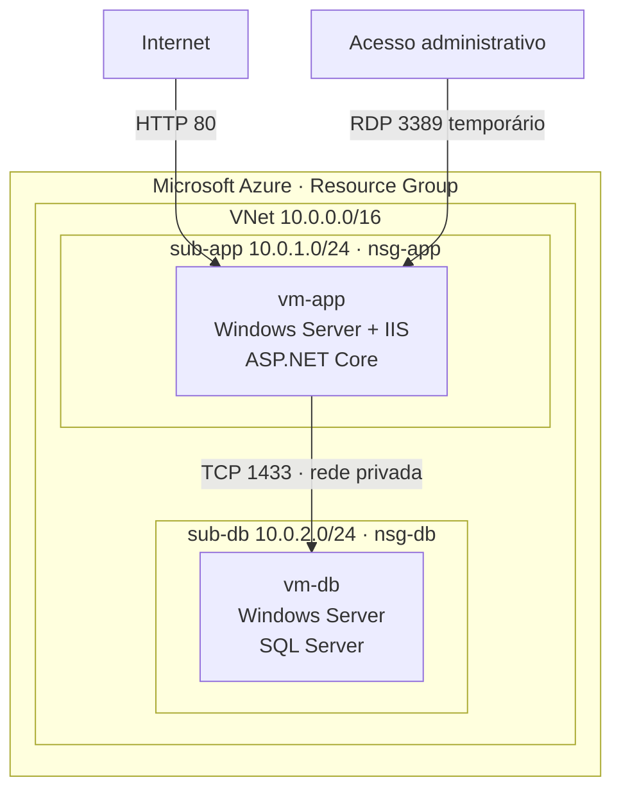
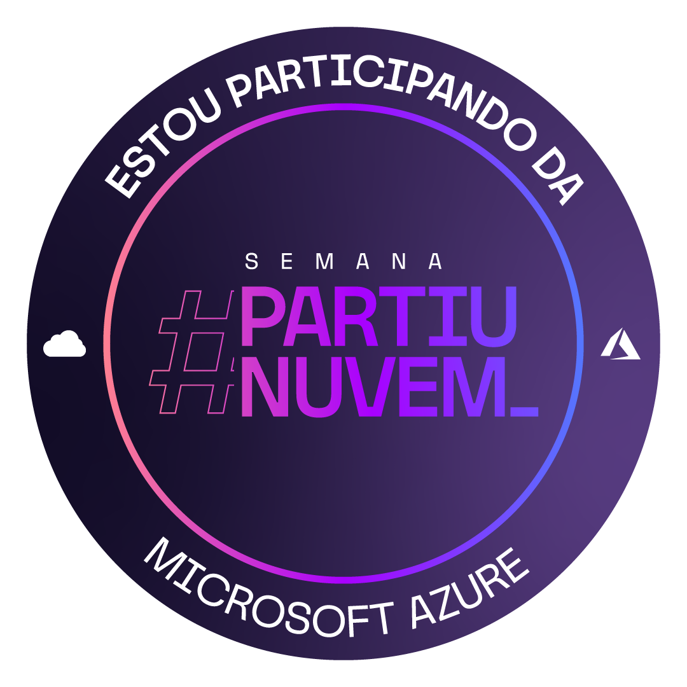
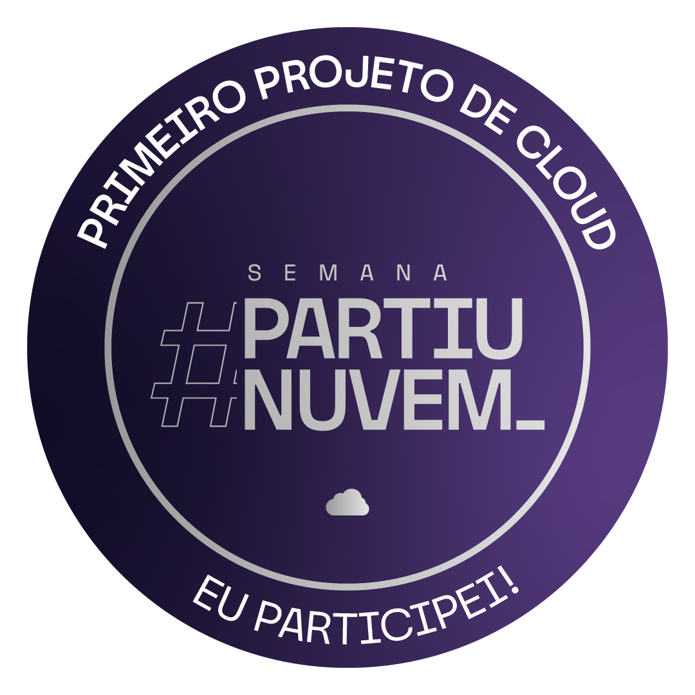

# Azure IaaS Web + SQL Server Lab

Laboratório de infraestrutura em duas camadas no Microsoft Azure, com uma aplicação ASP.NET Core hospedada no IIS e um SQL Server executado em uma VM separada.

O objetivo foi aplicar conceitos de IaaS, segmentação de rede, regras de segurança e comunicação privada entre servidores. Além da implantação, o laboratório envolveu diagnóstico de conectividade, certificado TLS, dependência de runtime e publicação HTTP.

> Ambiente criado exclusivamente para estudo e removido após a validação para interromper o consumo de créditos.

## Arquitetura



As duas subnets pertenciam à mesma VNet e utilizavam o roteamento interno do Azure. Não foi necessário criar peering entre elas.

## Componentes

| Componente | Função |
|---|---|
| Resource Group | Agrupamento e ciclo de vida dos recursos |
| Virtual Network | Rede privada `10.0.0.0/16` |
| `sub-app` | Segmento da camada de aplicação |
| `sub-db` | Segmento da camada de dados |
| `nsg-app` | Controle de entrada da aplicação |
| `nsg-db` | Controle de entrada do banco |
| `vm-app` | IIS e aplicação ASP.NET Core |
| `vm-db` | SQL Server e banco da aplicação |

## Fluxo de comunicação

1. O usuário acessava a aplicação pela porta HTTP 80 da `vm-app`.
2. O IIS iniciava a aplicação ASP.NET Core.
3. A aplicação resolvia o nome privado `vm-db`.
4. A comunicação com o SQL Server ocorria internamente pela porta TCP 1433.
5. O banco não precisava ser exposto publicamente para atender à aplicação.

## Implementação

### Servidor de aplicação

O IIS foi instalado na `vm-app` com PowerShell:

```powershell
Install-WindowsFeature -Name Web-Server -IncludeManagementTools
```

A aplicação disponibilizada para o evento foi colocada em:

```text
C:\inetpub\wwwroot\partiunuvem
```

A aplicação utilizada no laboratório pertence ao projeto [raphasi/semanapartiunuvem](https://github.com/raphasi/semanapartiunuvem). Este repositório documenta minha implantação e não redistribui o código original.

### Servidor de banco de dados

A `vm-db` foi provisionada a partir de uma imagem do Azure Marketplace com SQL Server. O banco foi configurado no SQL Server Management Studio e acessado pela aplicação utilizando SQL Server Authentication.

A string de conexão utilizou o nome/IP privado do servidor. Credenciais foram omitidas deste repositório.

### Regras de rede

| Origem | Destino | Porta | Finalidade |
|---|---|---:|---|
| Internet | `vm-app` | TCP 80 | Acesso HTTP à aplicação |
| IP administrativo | VMs | TCP 3389 | RDP temporário durante o laboratório |
| `sub-app` | `vm-db` | TCP 1433 | Comunicação da aplicação com o SQL Server |

Em um ambiente de produção, RDP não deve permanecer exposto à Internet. O acesso administrativo deve ser restrito e preferencialmente realizado por uma solução como Azure Bastion, VPN ou jump host.

## Validações realizadas

- IIS respondendo localmente na porta 80;
- aplicação ASP.NET Core inicializando corretamente;
- resolução do nome privado `vm-db`;
- conectividade TCP entre `vm-app` e `vm-db` na porta 1433;
- autenticação no SQL Server;
- consulta da aplicação ao banco;
- acesso HTTP externo à aplicação;
- remoção dos recursos ao final do laboratório.

## Troubleshooting

Durante a implantação, foram investigados problemas em diferentes camadas:

- acesso RDP bloqueado por ausência de regra no NSG associado à subnet;
- validação de certificado no SQL Server Management Studio;
- erro `HTTP 502.5` causado pela ausência do runtime .NET 6;
- tentativa automática do navegador de utilizar HTTPS em um serviço publicado somente em HTTP.

O diagnóstico completo está em [docs/troubleshooting.md](docs/troubleshooting.md).

## O que aprendi

- diferença entre associar um NSG à subnet e à interface de rede;
- uso de IP público para administração/publicação e IP privado para comunicação interna;
- segmentação de aplicação e banco em subnets distintas;
- teste de portas com `Test-NetConnection`;
- leitura de eventos do IIS para encontrar a causa real de um erro genérico;
- convivência lado a lado de versões do .NET;
- importância de desligar ou remover recursos de laboratório para controlar custos.

## Badges do evento

As badges abaixo registram etapas da **Semana #PartiuNuvem**. Elas representam participação e conclusão dos desafios propostos no evento; não são certificações profissionais da Microsoft.

<table>
  <tr>
    <td align="center"></td>
    <td align="center"></td>
    <td align="center"></td>
  </tr>
  <tr>
    <td align="center"><strong>Participação</strong><br>Conclusão da primeira etapa do evento.</td>
    <td align="center"><strong>Primeiro projeto de Cloud</strong><br>Implantação e funcionamento da aplicação web no Azure.</td>
    <td align="center"><strong>Modernizando a aplicação</strong><br>Conclusão do desafio correspondente no evento.</td>
  </tr>
</table>

> A atividade de migração baseada no Data Migration Assistant não foi documentada como executada, pois a ferramenta havia sido descontinuada. A limitação está registrada no escopo do laboratório.

## Escopo e limitações

Este foi um laboratório educacional de curta duração. Não foram implementados balanceamento de carga, alta disponibilidade, TLS público, backup, monitoramento centralizado ou migração de banco. A etapa originalmente baseada no Data Migration Assistant não foi incluída porque a ferramenta foi descontinuada.

## Próximos passos

- reproduzir a infraestrutura com Bicep ou Terraform;
- substituir o acesso RDP público por Azure Bastion ou VPN;
- habilitar HTTPS com certificado válido;
- adicionar Azure Monitor e Log Analytics;
- aplicar princípio de menor privilégio às regras de rede e identidades.
